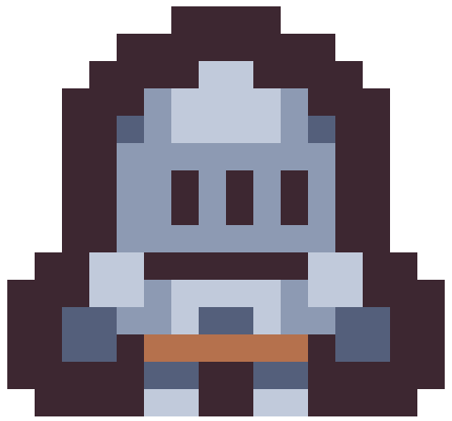

# 2D Survivor game in Godot

This is a game I made as part of my Godot learning process, while following [Firebelley's Udemy course](https://www.udemy.com/course/create-a-complete-2d-arena-survival-roguelike-game-in-godot-4/). The game is based on Vampire Survivor game.

All assets used in this project are free of license. References to them can be found in the references section below.

## Getting started

For development: Just clone the repository, and import it in Godot as a new project.

If you want to try the game, head to [releases](https://github.com/ivallesp/Godot2DSurvivorGame/releases).

## References

- [Tiny dungeon Kenney assets](https://www.kenney.nl/assets/tiny-dungeon)
- [Music Jingles Kenney assets](https://www.kenney.nl/assets/music-jingles)
- [Impact Sounds Kenney assets](https://www.kenney.nl/assets/impact-sounds)
- [UI Audio Kenney assets](https://www.kenney.nl/assets/ui-audio)
- [NB Pixel Font Bundle by Nimble Beasts Collective](https://nimblebeastscollective.itch.io/nb-pixel-font-bundle)
- [Color vignette from Godot Shaders](https://godotshaders.com/shader/color-vignetting/)
